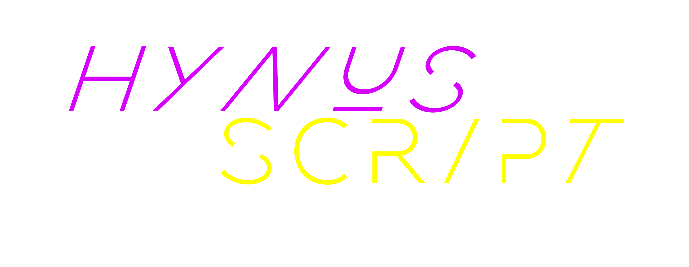

# HynusScript (HScript) - HynusWynus Automation
HScript was created to act the same way as a shell script or batch file. 
My biggest goal while making this language was for ease of use among all program users. I want this language to be easier to pickup and learn
regardless of if you started with C, or Python.

Comments are started with either 

```c
// comment
```
Or
```py
# comment
```

Multiline comments can also be made with 
```c
"/* comment */"
```

Or three '#' as both the opening and closing tags:
```py
###
Comment
###
```

This is done to be compliant with Python and C-Family language users.
The syntax of this language is also JavaScript based, with a small blend of Python and BashScript.

Constant types:
    int (32 bit)
    uint (32 bit)
    byte (8 bit)
    string
    char
    null (also treated like the C-Family keyword 'void')

HScript also supports initiating integer values with hex or binary. 
Such as: 
```js
0x0FF

or

0b1111
```

The letters in each type can also be capitalized. Such like: 
```js
0X0FF

or

0B1111
``` 

The boolean keywords are traditional 'true' and 'false', but HScript also supports Pythons weird capitalized keywords 'True' and 'False'.

HScript also supports all common C-Family operators. Such as '==', '!=', '>', '<', '<=', '>=', etc. But you can also use special operators.
Such as unary operators ('~', '-', '+'), and double operators ('++', '--'). Although, double operators will not function the same in a normal language where
the placement of the operator determines how it is used.

There are also some other operators custom to HScript.
The ":==" and ":!=" operators. These operators will check if the input value types match.

Example:
```js
WriteLine("Types match: ", true :== false); // Output: "Types match: True"
```

Even if "true" and "false" do not equal each other, their types do. They're both boolean values, so the ":==" operator will return true. This is especially useful in a
dynamic language, where the type of the variable cannot always be determined.

The equivalent of this in JavaScript would be:
```javascript
typeof(myBool) === "bool"
```
And in Python:
```python
isinstance(myBool, bool)
```

But here, it has been simplified to:
```bash
myBool :== true # "false" would work as well, you just need an instance of the type
```

HScript still has a "GetType" function. So you can also use:
```js
GetType(myBool) == GetType(true)
```

HScript files have some optional lines used for interpreter configuration. These lines will start with "?>>".
An example would be the interpreter version:
```bash
?>> 1.3.55.2
```

This line tells the interpreter that the version the script was designed for was v1.3.55.2. The interpreter will throw an error if the script version is newer than
it, and will only throw a warning if the interpreter version is newer than the script.

Another option to be used is "enableLowerStyle". This will change the built in function names from PascalCase to camelCase.


# Custom Features
HScript provides a few features that other languages don't. One of these features that isn't exactly "genius", but is my overall favorite is the ability to change the format of all built in functions.

Take this code block for example:

```bash
# According to default syntax (PascalCase)
WriteLine "This is the script version: {0}", sVersions
```

This code block looks pretty normal. Pretty boring.
Well, let's spice it up with a new style case!

```bash
?>> style camel # Changes format to camelCase
writeLine "This is the script version: {0}", sVersions
```

And this code will *still work*.

In total, there are 5 different code styles built into HScript. PascalCase (by default), snake_case, kebab-case, camelCase, and for gits-n-shiggles, piglatin case. Yes. You can change all built in methods to be piglatin. This is what the same codeblock will look like with the piglatin style:

```bash
?>> style piglatin # Changes format to piglatin
itelinewray "This is the script version: {0}", sVersions
```

Sadly, this will only convert the built in function names. The environment variables wont be changed, nor will the way data is interpreted. That would have been a great way to obfuscate the script, and might be a feature I add at some point.